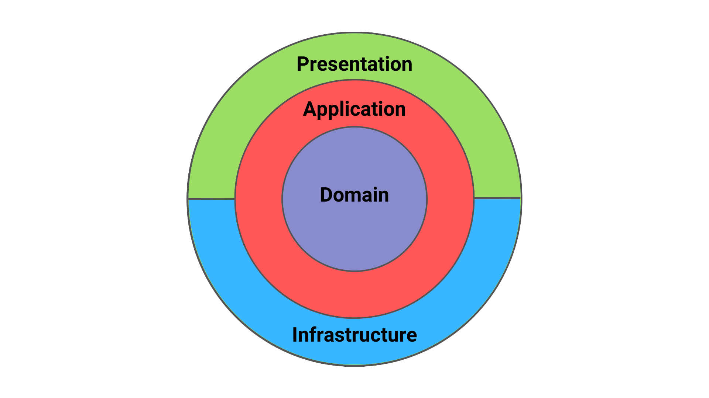

# NestJS Clean Architecture

## Introducción
Este documento describe la estructura de Clean Architecture en una API desarrollada con NestJS. Se incluyen los endpoints, la forma de inicialización del proyecto y una explicación de la arquitectura.

---

## Inicialización del Proyecto en NestJS

### 1. Requisitos Previos
Antes de ejecutar el proyecto, asegúrate de tener instalado:
- Node.js
- NestJS CLI

### 2. Instalación
```sh
npm install
```

### 3. Ejecución del Servidor
```sh
npm run start:dev
```

---

## Endpoints

### 1. Crear Producto
#### **Request**
- **Method**: `POST`
- **URL**: `/products`
- **Body**:
```json
{
  "name": "Gorra Adidas",
  "price": 39.99,
  "sku": "ADIDAS123",
  "category": "Deportes",
  "stock": 50,
  "description": "Gorra deportiva con tecnología Climalite"
}
```

#### **Response**
```json
{
  "id": "generated-product-id",
  "message": "Product created successfully!"
}
```

### 2. Obtener Producto
#### **Request**
- **Method**: `GET`
- **URL**: `/products/:id`

#### **Response**
```json
{
  "id": "generated-product-id",
  "name": "Gorra Adidas",
  "price": 39.99,
  "sku": "ADIDAS123",
  "category": "Deportes",
  "stock": 50,
  "description": "Gorra deportiva con tecnología Climalite"
}
```

### 3. Actualizar Producto
#### **Request**
- **Method**: `PUT`
- **URL**: `/products/:id`
- **Body**:
```json
{
  "price": 44.99,
  "stock": 45
}
```

#### **Response**
```json
{
  "message": "Product updated successfully!"
}
```

### 4. Eliminar Producto
#### **Request**
- **Method**: `DELETE`
- **URL**: `/products/:id`

#### **Response**
```json
{
  "message": "Product deleted successfully!"
}
```

---

## Explicación de Clean Architecture


### 1. Principios de Clean Architecture
Clean Architecture se basa en la separación de responsabilidades a través de capas bien definidas:


Arquitectura de software propuesta por Robert C. Martin (Uncle Bob) que busca mantener los sistemas flexibles, mantenibles y testeables. Se basa en la idea de separar las responsabilidades del código en capas bien definidas, con el objetivo de minimizar las dependencias entre ellas y facilitar la escalabilidad del software.

### Principios Clave de Clean Architecture
- Independencia de frameworks: La arquitectura no depende de bibliotecas o frameworks externos. Estos se tratan como herramientas en lugar de ser la base del sistema.

- Independencia de la UI: La interfaz de usuario (web, móvil, CLI, etc.) puede cambiar sin afectar la lógica del negocio.

- Independencia de la base de datos: El sistema no está acoplado a una base de datos específica, permitiendo cambiarla sin afectar la lógica central.

- Independencia de agentes externos: La lógica del negocio no depende de detalles específicos de infraestructura, como APIs, servidores o sistemas externos.

### Capas

- **Capa de Entidades (Domain Layer)**: Define las entidades y reglas de negocio.
- **Capa de Casos de Uso (Application Layer)**: Contiene la lógica de la aplicación y orquesta las interacciones entre entidades y servicios.
- **Capa de Infraestructura (Infrastructure Layer)**: Implementa los adaptadores para acceder a bases de datos, servicios externos, etc.
- **Capa de Presentación (Interface Layer)**: Maneja la comunicación con el usuario, incluyendo controladores y API REST.



### 2. Estructura del Proyecto en NestJS

```
/src
│── application
│   ├── use-cases
│   │   ├── create-product.usecase.ts
│   │   ├── get-product.usecase.ts
│   │   ├── update-product.usecase.ts
│   │   └── delete-product.usecase.ts
│── domain
│   ├── entities
│   │   ├── product.entity.ts
│   ├── interfaces
│   │   ├── product-repository.interface.ts
│── infrastructure
│   ├── repositories
│   │   ├── in-memory-product.repository.ts
│── presentation
│   ├── controllers
│   │   ├── product.controller.ts
```

---

## Conclusión
Clean Architecture en NestJS permite una organización modular y escalable del código. Separar responsabilidades en capas bien definidas facilita el mantenimiento y futuras mejoras en la aplicación.

